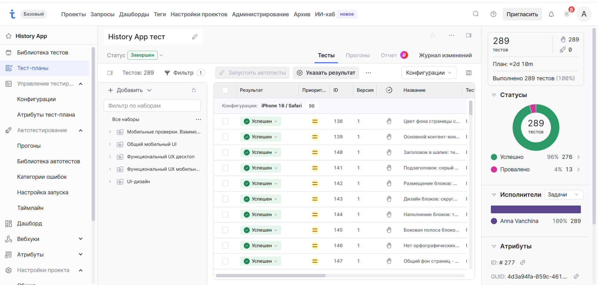

# History App - тестирование обучающего SPA-приложения "История Древнего мира"

## Описание проекта

Комплексное тестирование интерактивного веб-приложения (SPA) для обучения детей истории Древнего мира. Приложение разработано по принципу Mobile-First и развёрнуто на GitHub Pages: [annavanchina27.github.io/history-app](https://annavanchina27.github.io/history-app/)

Выполнялось:

* Проектирование тест-дизайна: кроссбраузерное и кроссплатформенное тестирование с нуля.
* Ведение тестовой документации и прогон в TMS-системе Test IT.
* UI/UX, функциональное и системное мобильное тестирование.
* Локализация дефектов адаптивной вёрстки и доступности интерфейса.

## Что тестировалось

**UI и адаптивность**
Главный экран, сквозной UI страниц параграфов 1–4, блок "Хронология", страница "Итоговый тест", поведение вёрстки на разных разрешениях экрана.

**Функциональность (десктоп)**
Логика переходов, взаимодействие с тестами и блоком "Хронология", клавиатурная доступность (Tab / Enter).

**Системный мобильный UX**
Поворот экрана, работа при входящих звонках и уведомлениях, поведение в фоне и при блокировке экрана, стабильность при переключении сети / офлайн.

Окружения: Windows 11 / Chrome, iPhone 16 / Safari, Android (Realme Note 60x) / Chrome Mobile.

## Артефакты тестирования

* 📋 [Чек-лист тестирования](https://docs.google.com/spreadsheets/d/e/2PACX-1vRo3-wEx1m-Aj4OhvKrCO50h1KiBBzcDYvlwBq75iSOaMu5dtUgSfXt-oWmau1VATe7DPEP2-QYUOTI/pubhtml) - 137 проверок по приоритетам и трём окружениям, вкладка с баг-репортами.
* 📄 [Отчёт о тестировании](https://docs.google.com/document/d/e/2PACX-1vTH-5Dq5jWqad9Iw41wCkTGkXI97_MSAGOvCJs2f4gVJV5rGH2VyZBNXvGwqxCEnADiTmiCvNyi2ij7/pub) — методология, статистика прогона, найденные дефекты, рекомендации.
* Test IT Cloud -  библиотека тестов, конфигурации окружений, тест-план и прогон (289 тестовых точек, 96% Passed).

## Найденные дефекты

| ID | Описание | Окружение |
|---|---|---|
| HA-1 | Название параграфа смещается влево при переносе текста (1, 4) | iOS, Android |
| HA-2 | Деформация кнопки "Назад", смещение иконки стрелки в Portrait | iOS, Android |
| HA-3 | Цвет текста вариантов ответа - синий вместо чёрного | iOS |
| HA-4 | Клавиатурная навигация (Tab + Enter) не работает на главном экране | Windows |

Все дефекты среднего приоритета, визуальные или связаны с доступностью - прохождение теста не блокируют.

## Как пользоваться

1. Чек-лист - матрица результатов по приоритетам и окружениям, там же вкладка с баг-репортами.
2. Отчёт - метрики качества, выводы и предложения по улучшению UX.
3. Test IT - тест-план и результаты прогона по трём конфигурациям.

## Инструменты

* TMS: Test IT Cloud (секции, конфигурации окружений, тест-раны).
* Документирование: Google Sheets / Google Docs, публикация в веб.
* Отладка: Chrome DevTools (эмуляция мобильных разрешений, инспектирование CSS).
* Платформы: Windows 11, iOS 26 (iPhone 16 / Safari), Android 16 (Realme Note 60x / Chrome Mobile).

## Автор

Anna Vanchina, QA Engineer.
